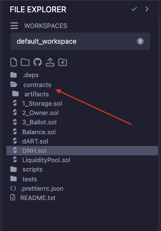

# Deploying Smart Contracts

Here I will guide you to deploy smart contracts with Remix IDE

Go to [https://remix.ethereum.org/](https://remix.ethereum.org/)

Look at left side, you would see the folder structure

* Create new file with extension `.sol` in folder `contract`

<figure><figcaption></figcaption></figure>

* I will you some sample smart contract code for creating new Token in SWAN

```
// SPDX-License-Identifier: GPL-3.0
pragma solidity ^0.8.9;

import "@openzeppelin/contracts/token/ERC20/ERC20.sol";
import "@openzeppelin/contracts/access/Ownable.sol";

contract DNHToken is ERC20, Ownable {

  constructor(uint256 initialSupply) ERC20("DNHToken", "DNH") Ownable(msg.sender) {
    _mint(msg.sender, initialSupply * (10**uint256(18)));
  }

  function mint(address to, uint256 amount) public onlyOwner {
    _mint(to, amount);
  }

}
```

* Copy all code above to your file you created then Ctrl + S to save
* After saving, IDE will compile your code then you will see

<figure><figcaption></figcaption></figure>

* Next, you click in the below button to deploy your compiled code

<figure><figcaption></figcaption></figure>

* Connect your Metamask, then Choose `Injected Provider`

<figure><figcaption></figcaption></figure>

* If you reach this step, you will see your address and your SWANETH Token

<figure><figcaption></figcaption></figure>

* Then you should choose like a image below, and fill 1B total supple

<figure><figcaption></figcaption></figure>

* Click `Deploy` and you have to sign with Metamask to deploy your contract. If you deploy your contract successfully, I will see in the log

<figure><figcaption></figcaption></figure>

* Note that, If you got error in deploy step. You can change your EVM server like image below. Then Deploy again

<figure><figcaption></figcaption></figure>

* If you reached here, congratulations! You Done. You just created a smart contract aka txn
